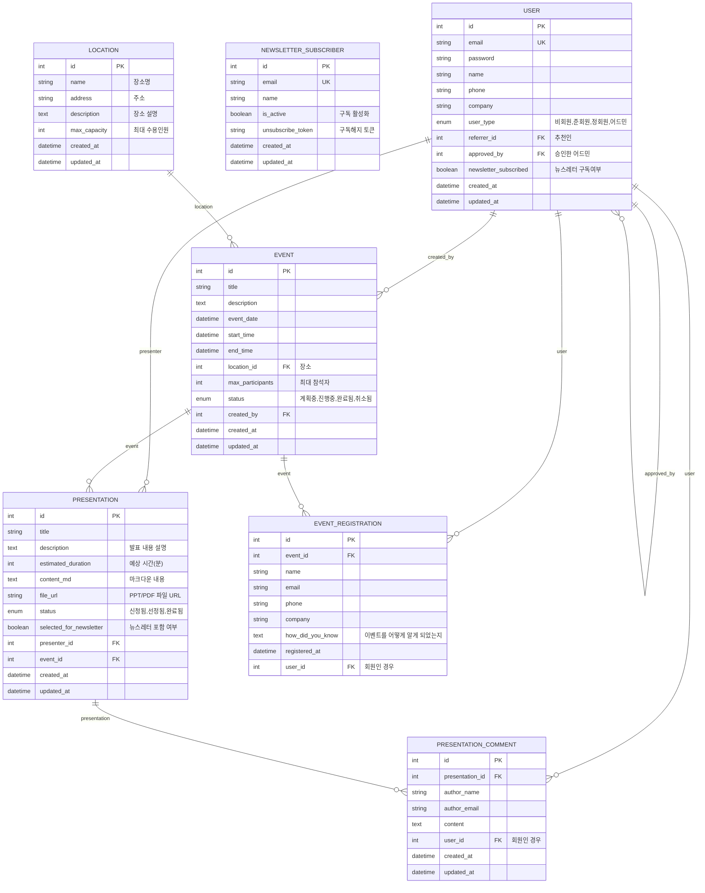

# PyThing Event Platform

## ✅ 핵심 목표

- 사용자가 **장소 예약**을 신청할 수 있다.
- 필요한 정보는 **자동으로 채워지고**, 사용자는 검토/수정만 하면 된다.
- 예약 상태, 포스터, 홍보, 참석자 목록을 **한눈에 볼 수 있는 UI** 제공.

---

## 🚀 이벤트 자동화 흐름

1. **장소 예약 신청**
   - 날짜, 장소, 시간 등 필수 정보 입력
   - 나머지 정보(행사 목적, 소개, 참가자 등)는 맥락(간단 설명)만 입력하면 Claude API로 자동 완성
   - 사용자가 자동 완성된 폼을 검토/수정 후 제출

2. **예약 확정**
   - 장소 예약이 확정되면 포스터 자동 생성
   - LinkedIn/이벤터스 등 외부 홍보 채널에 자동 등록(스크래핑/연동)
   - 참석자 모집(구글폼 등 연동)

3. **이벤트 관리**
   - 대시보드에서 예약 상태, 포스터, 홍보 현황, 참석자 명단 등 한눈에 확인
   - 발표 자료 업로드, 댓글(피드백) 기능 제공

---

## 🧩 주요 기능

- **장소 예약**: 마루180, 마루360 등 주요 공간 지원
- **자동 폼 완성**: Claude API로 행사 목적/소개/참가자 등 자동 채움
- **포스터 자동 생성**: 예약 확정 시 포스터 이미지/PDF 자동 생성
- **홍보 자동화**: LinkedIn, 이벤터스 등 외부 채널 연동
- **참석자 관리**: 구글폼/스프레드시트 연동, 참석자 명단 다운로드
- **발표 관리**: 정회원만 발표 신청 가능, 발표 자료 업로드/댓글 지원
- **회원 등급/승인**: 어드민 승인 기반 회원 등급 관리
- **뉴스레터**: 회원/비회원 구독, 구독 해지/이력 관리

---

## 🏗️ 데이터 설계 요약

- **User**: 회원/비회원, 추천인, 어드민 승인, 뉴스레터 구독 등
- **Location**: 장소 정보, 최대 수용 인원 등
- **Event**: 행사 정보, 상태, 장소, 생성자 등
- **Presentation**: 발표 정보, 발표자, 자료 업로드, 댓글
- **EventRegistration**: 참석 신청, 구글폼 연동
- **NewsletterSubscriber**: 뉴스레터 구독/해지 관리

> 자세한 ERD는 README 하단 mermaid 코드 참고

---

## 🛠️ 추천 기술 스택

- **백엔드**: Django DRF
- **DB**: PostgreSQL
- **외부 연동**: Google Sheets, LinkedIn, 이벤터스, Slack

---

## 🖥️ 페이지 구성 예시

- **대시보드**: 이벤트 카드, 상태, 포스터, 홍보 현황
- **이벤트 예약/생성**: 장소/날짜/시간 입력, 맥락 입력, 자동완성 폼
- **이벤트 상세**: 예약 정보, 포스터, 홍보, 참석자 명단, 발표 자료
- **참석자 관리**: 구글폼 링크, 명단 다운로드
- **발표 관리**: 발표 신청/수정/삭제, 자료 업로드, 댓글

---

## 💡 자동화/지능화 포인트

- **맥락 기반 자동완성**: 사용자가 핵심 정보만 입력하면 나머지는 AI가 채움
- **객체지향 장소 설계**: 장소별로 필요한 필드/패킷 구조를 유연하게 지원
- **외부 채널 연동**: 예약/홍보/참석자 관리까지 원스톱 자동화

---

## 📄 ERD (요약)



---

## 🚀 개발 환경 설정 (Development Setup)

### 사전 요구사항
- Python 3.11+
- Node.js 및 npm

### 1. 저장소 클론
```bash
git clone https://github.com/rover0811/pything_event.git
cd pything_event/django_event_platform
```

### 2. Python 가상환경 및 의존성 설치
Python 가상환경을 생성하고 필요한 패키지를 설치합니다.

```bash
# Python 가상환경 생성
python -m venv .venv

# 가상환경 활성화 (macOS/Linux)
source .venv/bin/activate
# 가상환경 활성화 (Windows)
# .venv\\Scripts\\activate

# pip 최신 버전으로 업그레이드
pip install --upgrade pip

# pyproject.toml 기반으로 의존성 설치
pip install -e ".[dev]"
```

### 3. Frontend 의존성 설치
Tailwind CSS를 위한 Node.js 패키지를 설치합니다.

```bash
npm install
```

### 4. 데이터베이스 마이그레이션
개발용 데이터베이스(SQLite)를 생성하고 초기화합니다.

```bash
python manage.py migrate
```

### 5. 개발 서버 실행
두 개의 터미널을 열고 각각 다음 명령어를 실행합니다.

**터미널 1: Django 개발 서버**
```bash
python manage.py runserver
```
이제 브라우저에서 `http://127.0.0.1:8000` 로 접속할 수 있습니다.

**터미널 2: Tailwind CSS 빌드**
템플릿 파일의 변경 사항을 감지하여 CSS를 자동으로 빌드합니다.
```bash
npx tailwindcss -i ./static/css/globals.css -o ./static/css/tailwind.css --watch
```
> **Note**: `tailwind.config.js` 파일이 없어 기본적인 명령어를 제공합니다. 프로젝트 설정에 맞게 입력/출력 경로를 수정해야 할 수 있습니다.


## ⚙️ 환경 변수
`.env` 파일을 사용하여 환경 변수를 관리하는 것을 권장합니다. 프로젝트 루트에 `.env` 파일을 생성하고 아래 내용을 필요에 맞게 수정하세요.

```env
# .env.example

# Django Secret Key (프로덕션 환경에서는 반드시 변경하세요)
SECRET_KEY="your-super-secret-key"

# 데이터베이스 설정 (PostgreSQL 예시)
# DB_ENGINE=django.db.backends.postgresql
# DB_NAME=your_db_name
# DB_USER=your_db_user
# DB_PASSWORD=your_db_password
# DB_HOST=localhost
# DB_PORT=5432
```
`config/settings.py` 파일에서 `python-decouple` 등의 라이브러리를 사용하여 환경 변수를 불러오도록 수정해야 합니다.


##  문의/기여

- 이슈/기여 환영!
- 문의: rover0811@hotmail.com
