# PyThing Event Platform

## ✅ 핵심 목표

- 사용자가 **장소 예약**을 신청할 수 있다.
- 필요한 정보는 **자동으로 채워지고**, 사용자는 검토/수정만 하면 된다.
- 예약 상태, 포스터, 홍보, 참석자 목록을 **한눈에 볼 수 있는 UI** 제공.

---

## 🚀 이벤트 자동화 흐름

1. **장소 예약 신청**
   - 날짜, 장소, 시간 등 필수 정보 입력
   - 나머지 정보(행사 목적, 소개, 참가자 등)는 맥락(간단 설명)만 입력하면 Claude API로 자동 완성
   - 사용자가 자동 완성된 폼을 검토/수정 후 제출

2. **예약 확정**
   - 장소 예약이 확정되면 포스터 자동 생성
   - LinkedIn/이벤터스 등 외부 홍보 채널에 자동 등록(스크래핑/연동)
   - 참석자 모집(구글폼 등 연동)

3. **이벤트 관리**
   - 대시보드에서 예약 상태, 포스터, 홍보 현황, 참석자 명단 등 한눈에 확인
   - 발표 자료 업로드, 댓글(피드백) 기능 제공

---

## 🧩 주요 기능

- **장소 예약**: 마루180, 마루360 등 주요 공간 지원
- **자동 폼 완성**: Claude API로 행사 목적/소개/참가자 등 자동 채움
- **포스터 자동 생성**: 예약 확정 시 포스터 이미지/PDF 자동 생성
- **홍보 자동화**: LinkedIn, 이벤터스 등 외부 채널 연동
- **참석자 관리**: 구글폼/스프레드시트 연동, 참석자 명단 다운로드
- **발표 관리**: 정회원만 발표 신청 가능, 발표 자료 업로드/댓글 지원
- **회원 등급/승인**: 어드민 승인 기반 회원 등급 관리
- **뉴스레터**: 회원/비회원 구독, 구독 해지/이력 관리

---

## 🏗️ 데이터 설계 요약

- **User**: 회원/비회원, 추천인, 어드민 승인, 뉴스레터 구독 등
- **Location**: 장소 정보, 최대 수용 인원 등
- **Event**: 행사 정보, 상태, 장소, 생성자 등
- **Presentation**: 발표 정보, 발표자, 자료 업로드, 댓글
- **EventRegistration**: 참석 신청, 구글폼 연동
- **NewsletterSubscriber**: 뉴스레터 구독/해지 관리

> 자세한 ERD는 README 하단 mermaid 코드 참고

---

## 🛠️ 추천 기술 스택

- **백엔드**: FastAPI (or Django), Claude API 연동
- **프론트엔드**: Streamlit (MVP), React+HTMX (확장형)
- **DB**: PostgreSQL or MySQL
- **외부 연동**: Google Sheets, LinkedIn, 이벤터스, Slack

---

## 🖥️ 페이지 구성 예시

- **대시보드**: 이벤트 카드, 상태, 포스터, 홍보 현황
- **이벤트 예약/생성**: 장소/날짜/시간 입력, 맥락 입력, 자동완성 폼
- **이벤트 상세**: 예약 정보, 포스터, 홍보, 참석자 명단, 발표 자료
- **참석자 관리**: 구글폼 링크, 명단 다운로드
- **발표 관리**: 발표 신청/수정/삭제, 자료 업로드, 댓글

---

## 💡 자동화/지능화 포인트

- **맥락 기반 자동완성**: 사용자가 핵심 정보만 입력하면 나머지는 AI가 채움
- **객체지향 장소 설계**: 장소별로 필요한 필드/패킷 구조를 유연하게 지원
- **외부 채널 연동**: 예약/홍보/참석자 관리까지 원스톱 자동화

---

## 📄 ERD (요약)

```mermaid
erDiagram
    USER {
        int id PK
        string email UK
        string password
        string name
        string phone
        string company
        enum user_type "비회원,준회원,정회원,어드민"
        int referrer_id FK "추천인"
        int approved_by FK "승인한 어드민"
        boolean newsletter_subscribed "뉴스레터 구독여부"
        datetime created_at
        datetime updated_at
    }
    NEWSLETTER_SUBSCRIBER {
        int id PK
        string email UK
        string name
        boolean is_active "구독 활성화"
        string unsubscribe_token "구독해지 토큰"
        datetime created_at
        datetime updated_at
    }
    LOCATION {
        int id PK
        string name "장소명"
        string address "주소"
        text description "장소 설명"
        int max_capacity "최대 수용인원"
        datetime created_at
        datetime updated_at
    }
    EVENT {
        int id PK
        string title
        text description
        datetime event_date
        datetime start_time
        datetime end_time
        int location_id FK "장소"
        int max_participants "최대 참석자"
        enum status "계획중,진행중,완료됨,취소됨"
        int created_by FK
        datetime created_at
        datetime updated_at
    }
    PRESENTATION {
        int id PK
        string title
        text description "발표 내용 설명"
        int estimated_duration "예상 시간(분)"
        text content_md "마크다운 내용"
        string file_url "PPT/PDF 파일 URL"
        enum status "신청됨,선정됨,완료됨"
        boolean selected_for_newsletter "뉴스레터 포함 여부"
        int presenter_id FK
        int event_id FK
        datetime created_at
        datetime updated_at
    }
    EVENT_REGISTRATION {
        int id PK
        int event_id FK
        string name
        string email
        string phone
        string company
        text how_did_you_know "이벤트를 어떻게 알게 되었는지"
        datetime registered_at
        int user_id FK "회원인 경우"
    }
    PRESENTATION_COMMENT {
        int id PK
        int presentation_id FK
        string author_name
        string author_email
        text content
        int user_id FK "회원인 경우"
        datetime created_at
        datetime updated_at
    }
    USER ||--o{ USER : "referrer"
    USER ||--o{ USER : "approved_by"
    USER ||--o{ EVENT : "created_by"
    USER ||--o{ PRESENTATION : "presenter"
    USER ||--o{ EVENT_REGISTRATION : "user"
    USER ||--o{ PRESENTATION_COMMENT : "user"
    LOCATION ||--o{ EVENT : "location"
    EVENT ||--o{ PRESENTATION : "event"
    EVENT ||--o{ EVENT_REGISTRATION : "event"
    PRESENTATION ||--o{ PRESENTATION_COMMENT : "presentation"
```

---

## 시작하기

1. 저장소 클론 및 의존성 설치
2. `.env` 환경변수 설정 (DB, Claude API 등)
3. `uvicorn main:app --reload` 또는 `streamlit run app.py` 실행

---

## 문의/기여

- 이슈/기여 환영!
- 문의: rover0811@hotmail.com 